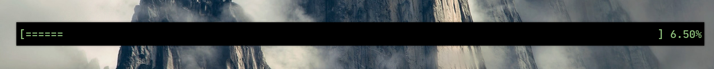

> Countdown timer built in Go




# Build
1. Install `go`

2. Build from source
```bash
$ git clone https://github.com/Murtaza-Udaipurwala/countdown
$ cd countdown
$ go build
```

# Usage
1. Help

```bash
$ ./countdown -h
```

2. Simple stopwatch
```bash
$ ./countdown
```

3. Countdown timer
```bash
$ ./countdown -s 10 # start a countdown timer for 10 seconds
```

```bash
$ ./countdown -m 10 # start a countdown timer for 10 minutes
```

```bash
$ ./countdown -h 1 -m 39 -s 18 # start a countdown timer for 1 hour, 39 minutes and 18 seconds
```

4. Colors
```bash
$ ./countdown -c # enable colorful output. To be used in conjuction with any flag
```

# Wrapper shell script
```bash
#!/bin/sh

clear

# hide cursor
if type setterm >/dev/null 2>&1; then
    setterm --cursor off
fi

trap 'reset' 2

countdown $@
reset
```
